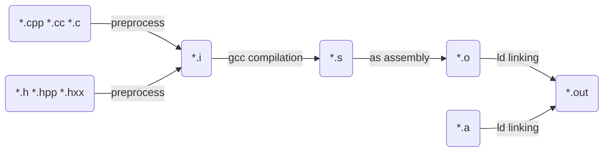

# <center>模板(Template)基本概念</center>

文中的范例参考自《C++ Templates》



- 预处理阶段(Preprocess): 展开宏，包含头文件，去掉注释，存储行号等信息。

- 编译阶段(compile): 词法分析，语法分析，语义分析，中间代码，代码优化等。

- 汇编阶段(assembly): 生成二进制文件。

- 链接阶段(link): 链接其他库，生成执行文件。

在开始进入模板之前，我们先谈谈没有模板时，C++会遇到什么问题。假定我们要求两个int型数的最大值，一般我们会实现为：

``` c++
int max(int a, int b) {
    return a < b ? b : a;
}
```

随着后期项目的需要，类似于long/float/double等都有需求，相应地，我们会分别实现：

``` c++
long max(int a, int b) {
    return a < b ? b : a;
}

float max(float a, float b) {
    return a < b ? b : a;
}

double max(double a, double b) {
    return a < b ? b : a;
}

...
```

基于上面的实现（除了类型不一致，实现都是一样的），聪明点的方式，大家会想到利用宏来屏蔽类型的差别：

``` c++
// 1
#define max(a, b) ((a) < (b) ? (a) : (b))

// 2
#define MAX(T, a, b)          \
    T max(T a, T b) {         \
        return a < b ? b : a; \
    }

MAX(int, a, b)
MAX(float, a, b)
MAX(double, a, b)
```

第一种方式在大部分情况下是好的，但当调用

``` c++
max(0, std::rand())
```

时，最终获取的结果并非是你想要的。第二种方式虽然没有问题，但我们会发现每新增一种类型，就要相应的用MAX定义下，这还要保证实现逻辑是相同的。

现在回到模板，它起源于

"Major inspirations for c++ templates were the parameterized modules provided by CLU and the generics provided by Ada."[wiki][1]

它主要是支持泛型编程。利用模板，上述的问题可以实现为：

``` c++
template <typename T>
T max(T a, T b) {
    return a < b ? b : a;
}
```

相较于宏实现，模板的优点包括：
1> 避免了多次手动重复繁琐定义。
2> 可以在编译阶段添加静态安全检查。
。。。

观察上面的模板实现，可以覆盖a和b类型相同时的情况，有兴趣的同学可以考虑当a和b类型不同或者是参数的个数是3个，4个，n个等。

上面的问题，我们先讨论到这。现在开始介绍模板，这里我会分四个模块：

- 函数模板(function templates)
- 类模板(class templates)
- 非类型模板(nontype templates)
- 可变参数模板(variadic templates)

## 函数模板(Function Templates)

1. **定义**

函数模板的定义形式为：
``` c++
template < comma-separated-list-of-parameters >
returnType func(Types parameters) {
    // body
} 
```
其和普通函数区别不大，可理解为将普通函数某参数几个类型抽象，进行泛型编程，例如：

maxAndMin.hpp:
``` c++
template <typename T>
T max(T a, T b) {
    return a < b ? b : a;
}

// if your compiler is before C++11, you must set T1 and T2 default Type
template <typename RT = double, typename T1, typename T2>
RT max(T1 a, T2 b) {
    return a < b ? b : a;
}

template <typename T>
T min(T a, T b) {
    return a < b ? a : b;
}
```

2. **使用**

具体到模板的使用，我们称为实例化(Instantiaiton)，分为显式实例化(Explicit Instantiation)和隐式实例化(Implicit Instantiation)。区分方式通过被使用模板函数后是否有*<>*。示例如下：

maxAndMin.cpp:
``` c++
#include "maxAndMin.hpp"

int main(int argc, char* argv[])
{
    int i = 42;
    ::max(i, 7);  // T max(T a, T b), T is int

    double f1 = 3.4;
    double f2 = -6.7;
    ::max(f1, f2);  // T max(T a, T b), T is double
    ::min(f1, f2);

    // ::min(i, f1);  ERROR, i is int and f1 is double, they can't match the common type T.

     ::max<double>(i, f1);  // RT max(T1 a, T2 b), RT is double, T1 is int, T2 is double
     ::max<int>(i, f1);  // RT max(T1 a, T2 b), RT is int, T1 is int, T2 is double
     ::max<int>(i, 7);  // T max(T a, T b), T is int
     ::max<int, int, int>(i, f1);
}
```
其中，::max和::min均为隐式实例化，::max<double>等为显式实例化。


3. **注意事项**

* 函数模板没有偏特化，只有重载。

* 不同于普通函数，函数模板可在中间设置默认参数类型。

* 匹配模板不支持隐式转换。


4. **思考题**

- 分析下面代码。
``` c++
#include <iostream>

template<typename T>
T max(T a, T b) {
    std::cout << "max<T> \n";
    return a < b ? b : a;
}

template <typename T>
T max(T a, T b, T c) {
    return max(max(a, b), c);
}

int max(int a, int b) {
    std::cout << "max(int, int) \n";
    return a < b ? b : a;
}

int main(int argc, char* argv[])
{
    ::max(47, 11, 33);  // why use max<T>() instead of max(int, int)?
}
```

## 类模板(Class Templates)

类模板和函数模板类似，我们直接通过一个例子讲解。

1. **定义和使用**

stack1.hpp:
``` c++
#include <vector>
#include <cassert>

template <typename T>
class Stack {
 public:
  void push(T const& elem);

  void pop();

  T const& top() const;

  bool empty() const {
      return elemes.empty();
  }

private:
 std::vector<T> elems;
};

template <typename T>
void Stack<T>::push(T const& elem) {
    elems.push_back(elem);
}

template <typename T>
void Stack<T>::pop() {
    assert(!elems.empty());
    elems.pop_back();
}

template <typename T>
T const& Stack<T>::top() const {
    assert(!elems.empty());
    return elems.back();
}
```

stack1Test.cpp:
``` c++
#include "stack1.hpp"
#include <iostream>
#include <string>

int main(int argc, char* argv[])
{
    Stack<int> intStack;
    Stack<std::string> stringStack;

    intStack.push(7);
    std::cout << inStack.top() << "\n";

    stringStack.push("hello");
    std::cout << stringStack.top() << "\n";
    stringStack.pop();

    return 0;
}
```

2. 特化(Specializations of Class Templates)

stack2.hpp:
``` c++
#include "stack1.hpp"
#include <deque>
#include <string>
#include <cassert>

template<>
class Stack<std::string> {
 public:
  void push(std::string const&);

  void pop();

  std::string const& top() const;

  bool empty() const {
      return elems.empty();
  }
};

void Stack<std::string>::push(std::string const& elem) {
    elems.push_back(elem);
}

void Stack<std::string>::pop() {
    assert(!elems.empty());
    elems.pop_back();
}

std::string const& Stack<std::string>::top() const {
    assert(!elems.empty());
    return elems.back();
}
```

3. **偏特化(Partial Specialization)**

stack3.hpp:
``` c++
#include "stack1.hpp"

template<typename T>
class Stack<T*> {
 public:
  void push(T*);

  T* pop();

  T* top() const;

  bool empty() const {
      return elems.empty();
  }
};

template<typename T>
void Stack<T*>::push(T* elem) {
    elems.push_back(elem);
}

template<typename T>
void Stack<T*>::pop() {
    assert(!elems.empty());
    T* p = elems.back();
    elems.pop_back();
    return p;
}

template<typename T>
T* Stack<T*>::top() const {
    assert(!elems.empty());
    return elems.back();
}
```

4. **默认参数(Default Class Template Arguments)**

stack4.hpp:
``` c++
#include <vector>
#include <cassert>

template<typename T, typename Cont = std::vector<T>>
class Stack {
 public:
  void push(T const& elem);
  void pop();
  T const& top() const;
  bool empty() const {
      return elems.empty();
  }

 private:
  Cont elems;
};

template <typename T, typename Cont>
void Stack<T, Cont>::push(T const& elem) {
    elems.push_back(elem);
}

template <typename T, typename Cont>
void Stack<T, Cont>::pop() {
    assert(!elems.empty());
    elems.pop_back();
}

template <typename T, typename Cont>
T const& Stack<T, Cont>::top() const {
    assert(!elems.empty());
    return elems.back();
}

template <typename T, typename Cont>
void Stack<T, Cont>::push_back(T const& elem) {
    elems.push_back(elem);
}
```

stack4Test.cpp:
``` c++
#include "stack4.hpp"
#include <deque>

int main(int argc, char* argv[])
{
    Stack<int> intStack;

    Stack<double, std::deque<double>> dblStack;

    ...
}
```

5. **注意点**

- 只有特化或偏特化，没有重载。
- 模板成员函数不能为虚函数。

## 非类型模板(Nontype Template Parameter)

1. **函数模板**
addvalue.hpp:
``` c++
template <int Val, typename T>
T addValue(T x) {
    return x + Val;
}
```

2. **类模板**
stacknontype.hpp:
``` c++
template <typename T, std::size_t MaxSize>
class Stack {
 public:
  Stack();
  void push(T const& elem);
  void pop();
  T const& top() const;
  bool empty() const {
      return numElems == 0;
  }
 private:
  std::array<T, MaxSize> elems;
  std::size_t numElems;
};

template <typename T, std::size_t MaxSize>
Stack<T, MaxSize>::Stack()
    : numElems(0) {}

template <typename T, std::size_t MaxSize>
void Stack<T, MaxSize>::push(T const& elem) {
    assert(numElems < MaxSize);
    elems[numElems] = elem;
    ++numElems;
}

template <typename T, std::size_t MaxSize>
void Stack<T, MaxSize>::pop() {
    assert(numElems != 0);
    --numElems;
}

template <typename T, std::size_t MaxSize>
T const& Stack<T, MaxSize>::top() const {
    assert(numElems != 0);
    return elems[numElems - 1];
}
```

3. **注意点**

- 非模板参数支持整数，enum类型，指针，std::nullptr和左值引用，*不支持float和double*。

## 可变参数模板(Variadic Templates)

varprint.hpp:
``` c++
#include <iostream>

void print() {}

template <typename T, typename... Types>
void print(T firstArg, Types... args) {
    std::cout << sizeof...(Types) << "\n";
              << sizeof...(args) << "\n";

    std::cout << firstArg << "\n";
    print(args...);
}

int main(int argc, char* argv[])
{
    std::string s("hello");
    print(7.5, s, "world");
    return 0;
}
```
可变参数模板在std标准库中运用包括make_shared/thread/tuple等，在c++17中对可变参数模板进行了扩展，有兴趣的可以了解下折叠表达式(Fold Expressions)。

## 补充

1. auto使用

```c++
auto x = 3;

template <typename T>
void f(T x);
```

2. lamda使用

```c++
[](auto x, auto y) {
    return x + y;
}

class SomeCompilerSpecificName {
 public:
  template <typename T1, typename T2>
  auto operator() (T1 x, T2 y) const {
      return x + y;
  }
};
```

[1]: http:en.m.wikipedia.org/wiki/Template_(C%2B%2B)
